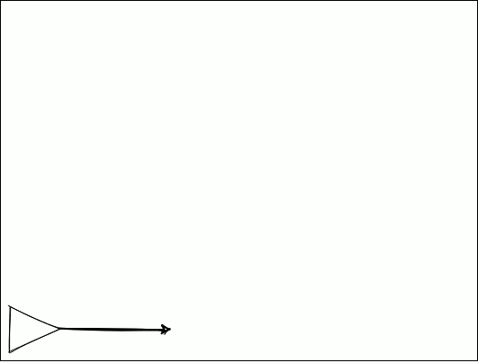

# Boids

## Table of Contents

-   [Definizioni](#definizioni)
-   [Steering Behaviour](#steering-behaviour)
    -   [Step By Step](#step-by-step)
        -   [Step 1](#step-1)
        -   [Step 2](#step-2)
        -   [Step 3](#step-3)
        -   [Step 4](#step-4)
    -   [Completo](#completo)
-   [Flock Behaviour](#flock-behaviour)
-   [Sources](#sources)

## Definizioni

| Nome          | sinonimi                      | Definizione                                                                               |
| ------------- | ----------------------------- | ----------------------------------------------------------------------------------------- |
| Vettore       | Forza, posizione nello spazio | Coppia di valori (x,y): possono rappresentare una posizione in uno spazio oppure una forza|
| Posizione     | Vettore posizione             | Coppia di coordinate nello spazio che rappresentano la posizione attuale del veicolo      |
| Velocità      | Vettore velocità              | Variazione della posizione                                                                |
| Accelerazione | Vettore accelerazione         | Variazione della velocità                                                                 |
| Veicolo       | Boid                          | Oggetto che possiede una posizione, una velocità e un determinato campo visivo            |
| Flock         | Stormo, branco                | Gruppo di veicoli                                                                         |

## Steering Behaviour

Una volta definito un target dobbiamo definire un comportamento per curvare lentamente verso di esso, creando un comportamento più naturale e graduale.
Craig Reynolds definisce questo come "Steering Behaviour".
È importante introdurre inoltre quindi il concetto:

> "Conosco lo stato attuale del veicolo (posizione, velocità) e voglio andare verso il target **a massima velocità**."

### Step By Step

#### Step 1

Calcolo la differenza tra la posizione del veicolo e del target, ottenendo un vettore che, visto dalla posizione attuale, punta fino al target.

```c++
// Vect2D position;
// Vect2D velocity;
// Vect2D target;
// double maxSpeed;
// double maxForce;
const Vect2D diff = (target - position)
```

#### Step 2

> "[...] voglio andare verso il target **a massima velocitá**."

Significa che devo limitare il vettore `diff` appena ottenuto ad una velocità massima; devo quindi impostare la "lunghezza" o "modulo" (in inglese Magnitude) a un valore maxSpeed.

```c++
// double maxSpeed;
const Vect2D desired = desired.setMagnitude(maxSpeed);
```

`desired` corrisponde alla velocità che potrei assumere nel prossimo step della animazione, ma voglio permettere l'interazione tra più forze per determinare come curvare. Inoltre, applicarlo direttamente comporterebbe un comportamento troppo scattoso e innaturale. Basti pensare a se il target fosse alle spalle del veicolo: significherebbe che in un singolo step il veicolo si girerebbe di 180 gradi, non è accettabile. Devo quindi trovare un modo diverso per curvare.

#### Step 3

Voglio peranto calcolare di quanto dovrei modificare la velocità **( = accelerazione)**. Questo si ottiene sottraendo alla velocità desiderata `desired` la velocità attuale `velocity`.

```c++
// Vect2D velocity;
const Vect2D acc = (desired - velocity)
```

Ottengo quindi l'accelerazione da sommare alla velocità per curvare verso il nostro target. Ma se lo facessi senza altre alterazioni all'accelerazione, risulterebbero i problemi descritti prima.

#### Step 4

Il passaggio chiave sta nella limitazione della forza di accelerazione, come prima abbiamo fatto per la velocità:
- maggiore è la maxForce e più a pieno applico l'accelerazione, ottenendo una curva più stretta per arrivare al target; 
- minore è la maxForce e meno applico l'accelerazione, ottenendo una curva più larga per arrivare al target

```c++
// double maxForce;
const Vect2d acclimited = acc.limit(maxForce);
```

Posso quindi combinare questa accelerazione, con altre derivate da diversi comportamenti, il risultato finale applicato alla velocità sarà dato dalla combinazione di tutte queste forze.

### Completo



```c++
// Vect2D position;
// Vect2D velocity;
// Vect2D target;
// double maxSpeed;
// double maxForce;
const Vect2D diff = (target - position)
const Vect2D desired = desired.setMagnitude(maxSpeed);
const Vect2D acc = (desired - velocity)
const Vect2d acclimited = acc.limit(maxForce);
```

Una volta definito questo comportamento si possono creare variazioni per casi particolari.

## Flock Behaviour

Un esempio di steering behaviour tra i più noti e affascinanti è il "Flock Behaviour", descritto da Craig Reynolds nella sua [pubblicazione](https://www.red3d.com/cwr/boids/).

| Nome         | Rappresentazione                                                     | Descrizione                                                                                            |
| ------------ | -------------------------------------------------------------------- | ------------------------------------------------------------------------------------------------------ |
| Separazione  |  | Sterza per evitare di scontrarsi con gli altri componenti dello stormo                                 |
| Coesione     |      | Sterza verso la posizione media degli altri componenti dello stormo                                    |
| Allineamento |    | Sterza per allineare la sua direzione con la media delle direzioni degli altri componenti dello stormo |

## Sources

-   [Craig Reynolds](https://www.red3d.com/cwr/)
-   [Craig Reynolds's Steering Behaviour](https://www.red3d.com/cwr/steer/)
-   [Craig Reynolds's Boids And Flocking Behaviour](https://www.red3d.com/cwr/boids/)
-   [Nature Of Code](https://natureofcode.com/book/chapter-6-autonomous-agents/): guida più aggiornata e dettagliata per implementare questi comportamenti.
