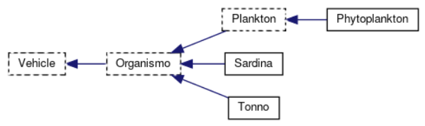

# Aquarius

<!--  -->

## Sommario

Aquarius é una simulatore di un ambienete dove diversi organismi interagiscono tra di loro.
In questo caso particolare abbiamo implementato organismi marini.

## Vect2D

La classe Vect2D rappresenta un vettore a due dimensioni con tutte le operazioni necessarie per effettuare tutti i calcoli dietro ogni spostamento dei veicoli all'interno dell'acquario.
Ha una parte di funzioni non costanti che ritornano il riferimento alla classe stessa in modo da poter chimare funzioni a catena.
Le stesse sono disponibili anche in versione costante per quando l'oggetto é costante e ritornerá quindi un nuovo oggetto per valore, mantenendo la possibilitá di poter chiamare funzioni a catena con il ritorno.
Sempre le stesse funzioni sono disponibili in formato statico con ritorno per valore.
Effettua overload degli operatori aritmetici, che fanno da tramite per funzioni all'interno della classe.
Effettua overload degli operatori di comparazione.

## Gerarchia



## Descrizione delle chiamate polimorfe

### Veicolo

```cpp
// distruttore virtuale di default inutile ripeterlo
virtual void behaviour(Acquario*) = 0;
virtual bool isInRange(const Vect2D& v) const = 0;
virtual void advance(Aquarius* a, int phase) final;
```

### Organismo

```cpp
virtual void behaviour(Acquario*);
virtual bool isInRange(const Vect2D& v) const ;
virtual bool canSleep() const;
virtual bool canWakeup() const;
virtual bool isHungry() const = 0;
virtual int getValoreNutrizionale() const = 0;
```

## Note

Per maggiori dettagli riguardo al funzionamento dei veicoli all'interno della simulazione:

[Boids.md](./BOIDS.md)

## Todo

- [x] Mantenere la popolazione costante tramite una impostazione grafica, questo significa che ogni volta che un pesce viene eliminato, esso ricompare al centro dell'acquario.
- [ ] Spostare tutti i connect nel controller
- [x] Le modifiche non salvate andranno perse. Sicuro di volere uscire? yes, no 
- [ ]  QInputDialog::getInt(this, tr("Componi slides"), "Indice della prima slide:", 1, 1, 2147483647, 1, &ok1); https://doc.qt.io/qt-5/qinputdialog.html#getText
## Requisiti

-   [ ] almeno 3 tipi diversi istanziabili
-   [x] almeno una classe astratta
-   [x] almeno altezza 2
-   [x] container C a scelta (list, dlist, dqueue, queue, vector, ecc...)
-   [x] puntatore smart (deep copy, assignemnt, deconstructor) puntatori polimorfi a t che suppportano clonazione e distruzione profonda
-   [x] utilizzo del contenitore C per uno dei tipi della gerarchia incapsulati dentro il puntatore smart
-   [ ] input/output
